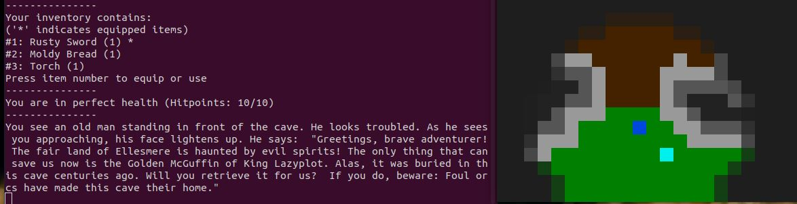

# DUNGEONS OF ELLESMERE - QUEST FOR THE GOLDEN McGUFFIN

## Introduction

This game was created as part of the Capstone project of the [Udacity C++ Nanodegree Program](https://www.udacity.com/course/c-plus-plus-nanodegree--nd213) and is based on the "Snake" starter repo example (see: https://github.com/udacity/CppND-Capstone-Snake-Game)

## How to Play
Welcome to Dungeons of Ellesmere, a proof-of-concept RPG written in C++ using the SDL-Library.  
The player takes on the role of a travelling adventurer on a (rather generic) quest to save the world - or at least collect the occasional loot that comes with defeating your enemies.    

Use the arrow keys to move the adventurer (blue square) across the map.  
Move on in-game objects to interact with them. You can:  
* talk to friendly NPCs (light blue squares)  
* collect treasure (yellow squares)  
* open treasure chests (brown squares)  
* fight opponents (red squares)  
In order to fight an opponent, you have to repeatedly move toward it using the arrow keys. Each key press equals one strike.    
Status information and dialogue is printed on the console, so make sure to keep an eye on the text output as well as the game map!    
Game control:  
At any time during the game, you can:  
* Press (p) for pausing / unpausing the game  
* Press (i) to take a look at your inventory  
* Press (c) to check your adventurer's health  
* Press (1-9) to use or equip items from your inventory    
Now have fun and save the world!

## Known Bugs and other issues

* Rendering is still buggy - objects like NPCs and Treasure sometimes come and go as they please - blame it on the poor lighting in the dungeon and the game is still playable ;)  
* NPCs are still not the smartest when it comes to find the best (or any, for that matter) path toward the player. Makes hiding easier, so not a bad thing overall  
* Loot should be spawning on the map - turn's out it doesn't. You collect it anyway, so again, nothing too serious.  
* Typos, typos, typos...!  
* Also, text formating could be prettier  
* Balancing: It's not exactly Starcraft yet, but should be OK for a minigame  

## Dependencies for Running Locally
* cmake >= 3.7
  * All OSes: [click here for installation instructions](https://cmake.org/install/)
* make >= 4.1 (Linux, Mac), 3.81 (Windows)
  * Linux: make is installed by default on most Linux distros
  * Mac: [install Xcode command line tools to get make](https://developer.apple.com/xcode/features/)
  * Windows: [Click here for installation instructions](http://gnuwin32.sourceforge.net/packages/make.htm)
* SDL2 >= 2.0
  * All installation instructions can be found [here](https://wiki.libsdl.org/Installation)
  >Note that for Linux, an `apt` or `apt-get` installation is preferred to building from source. 
* gcc/g++ >= 5.4
  * Linux: gcc / g++ is installed by default on most Linux distros
  * Mac: same deal as make - [install Xcode command line tools](https://developer.apple.com/xcode/features/)
  * Windows: recommend using [MinGW](http://www.mingw.org/)

## Basic Build Instructions  

1. Make sure SDL2 is installed (e.g.`sudo apt-get install libsdl2-2.0`)
2. Clone this repo.  
3. Make a build directory in the top level directory: `mkdir build && cd build`  
4. Compile: `cmake .. && make`  
5. Run it: `./Ellesmere`.  

## CC Attribution-ShareAlike 4.0 International

Shield: [![CC BY-SA 4.0][cc-by-sa-shield]][cc-by-sa]

This work is licensed under a
[Creative Commons Attribution-ShareAlike 4.0 International License][cc-by-sa].

[![CC BY-SA 4.0][cc-by-sa-image]][cc-by-sa]

[cc-by-sa]: http://creativecommons.org/licenses/by-sa/4.0/
[cc-by-sa-image]: https://licensebuttons.net/l/by-sa/4.0/88x31.png
[cc-by-sa-shield]: https://img.shields.io/badge/License-CC%20BY--SA%204.0-lightgrey.svg
